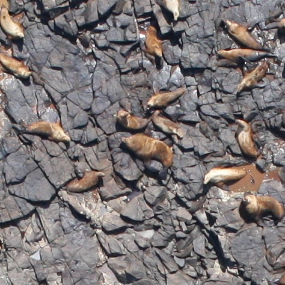

# Counting Sea Lions

I decided to dive into neural networks by tackling a [Kaggle competition](https://www.kaggle.com/c/noaa-fisheries-steller-sea-lion-population-count). The problem is, given a large aerial image, count the number of sea lions and, more specifically, the number of adult males, sub-adult males, adult females, juveniles and pups. Pups were especially challenging (try to find the 7 pups in this image):

The basic approach was to train a deep convolutional neural network to approximate a blurred density function for each of the classes of sea lions. The predicted counts are just the sum of this density function over the entire image.

This was implemented in Python using [Keras](https://keras.io/), with some raw [TensorFlow](https://www.tensorflow.org/) to deal with the density function. The neural network used a pre-trained image categorization network, with the final layer removed ([Xception](https://keras.io/applications/#xception) seemed to work the best).

This project was a collaboration with Victor Veitch and Geoffrey Scott.